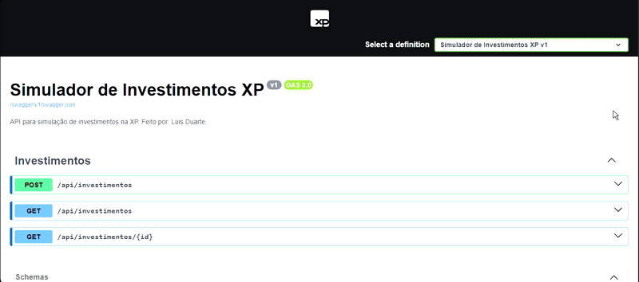

# 📈 Simulador de Investimentos  

🚀 **Projeto desenvolvido para simular investimentos com rentabilidade anual, utilizando C#, .NET e Swagger para testar requisições.**  

## 🛠️ Tecnologias Utilizadas
- C#  
- .NET 6  
- ASP.NET Core Web API  
- Swagger para documentação da API  

---

## 💻Requisições no Swagger

### 1. Criar um Novo Investimento (POST /api/investimentos)
### 2. Listar Todos os Investimentos (GET /api/investimentos)
### 3. Buscar um Investimento Específico (GET /api/investimentos/{id})
